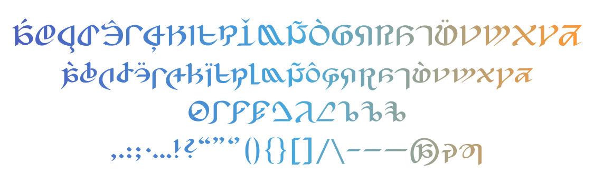

# 改良型新式艾欧泽亚文字

[ReadMe](README.md)

**非官方自制**字体，欢迎来到艾欧泽亚！

改良型新式艾欧泽亚文字进行了再设计，增加了更多语言支持与 Opentype 特性。

## 字符预览

当前支持:
- 基础拉丁字母 (A-Z, a-z)
- 带变音符号的拉丁字母 (对🇫🇷 🇩🇪 等语言的支持)
- 数字 (0-9)
- 常用标点与符号
- 以及……？

## 字偶间距预览

> _Containment Bay S1T7_

手工调节了字偶间距设定以提高可读性。可以在你喜欢的设计软件中选择“原始设定”以启用。

## Opentype 特性支持（默认关闭）

以下是当前支持的 Opentype 特性。设计上非常主观诠释，官方的材料中目前个人并没有看到类似的设计。所以以下特性均默认**关闭**，可以自行开启玩玩看。

### 连字 (dlig)

> _The Fist of the **Fa**ther_

### 花体字 (swsh)

> _Cent**ra**l Thanalan The Aethe**rf**ont_

### 变高数字 (onum)

> _The Holocharts - **6329** Yalms_
>
> _**0123456789**_

## 参考与来源

- 艾欧泽亚字母表 [_Encyclopaedia Eorzea II_](https://sqex.to/giPAn) | [《艾欧泽亚百科全书II》](https://www.taobao.com/list/item/635215701689.htm)
- [Celes](https://club.huijiwiki.com/wiki/%E7%89%B9%E6%AE%8A:%E9%A9%BE%E9%A9%B6%E5%AE%A4#/user/45979/main)（[@时与悠可](https://weibo.com/u/3506214112)）老师制作的[英文/艾欧泽亚文字/“被预测为”古代文字的字符对照表](https://weibo.com/3506214112/NkPbor2Iz)

## 授权

此处提及的所有公司、产品和系统名称均为其各自公司的商标或注册商标。

改良型新式艾欧泽亚文字以 [MIT](LICENSE) License 开源。

## 尾声

本工程未来的计划可能包括不同风格（无衬线？）或不同语言（不知道百科全书III会不会有诺弗兰特文字或[亚伊太利斯文字](https://github.com/karaipsum/Postulated-Proto-Alphabet)的字母表？）

欢迎在 Issues 里提出建议或错误。